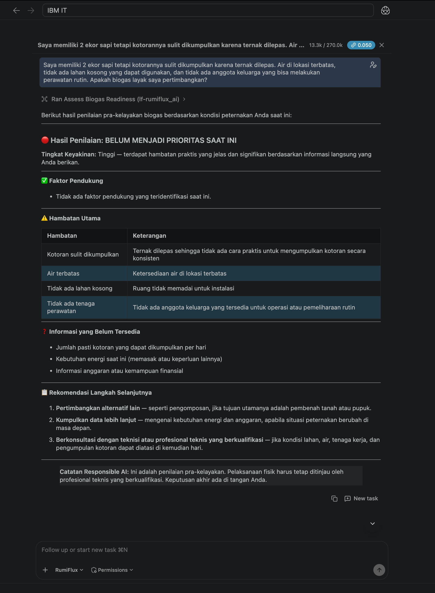
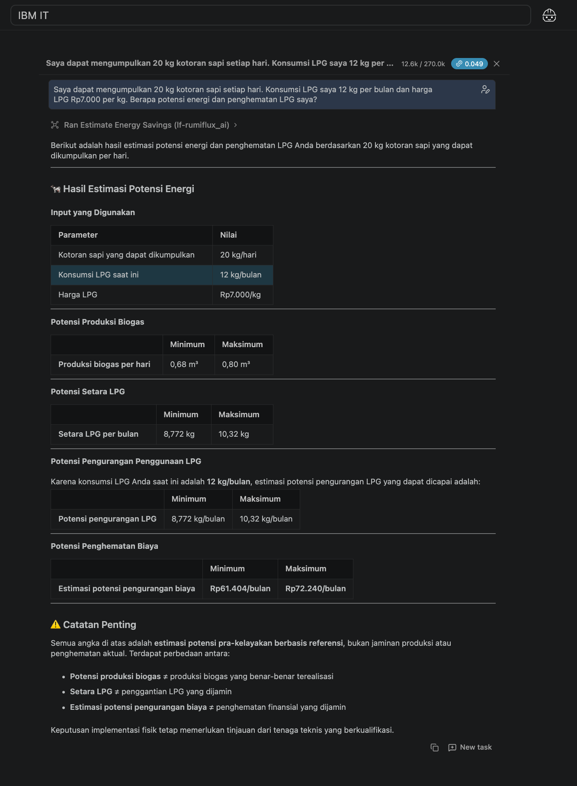
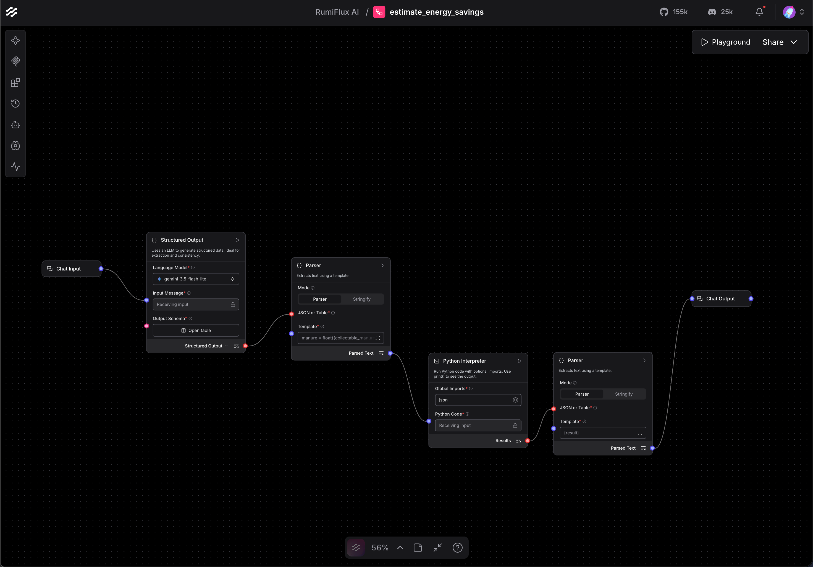
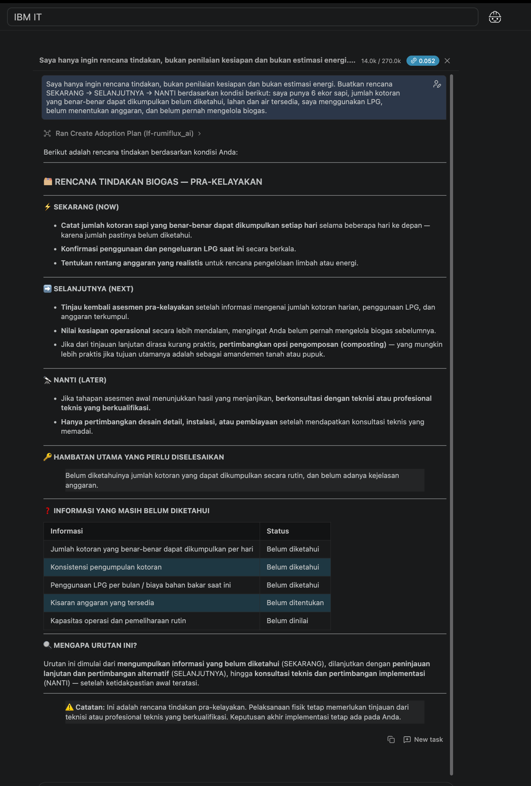
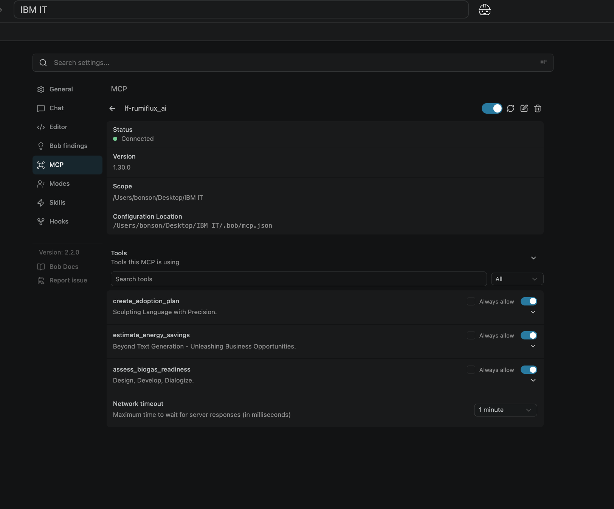

# RumiFlux AI

**AI-assisted decision support for small-scale biogas pre-feasibility.**

IBM Bob · MCP · Langflow · Astra DB · Python · RAG

RumiFlux AI helps livestock farmers make a more structured early-stage decision about biogas adoption.

It focuses on three practical tasks:

- assess biogas readiness
- estimate potential energy savings
- generate a staged adoption plan

The system is designed to identify what is feasible to assess now, what information is still missing, and what the next reasonable step should be.

## Why RumiFlux AI?

Biogas can be useful for livestock farms, but deciding whether it is suitable is not always straightforward.

Important information such as collectable manure, LPG consumption, available land and water, maintenance capability, and budget may be incomplete or scattered.

RumiFlux AI turns those inputs into a more structured early-stage assessment.

It is designed for pre-feasibility decision support, not engineering approval or final installation decisions.

## Core Tools

### 1. Biogas Readiness Assessment

`assess_biogas_readiness`

Evaluates farm conditions and identifies:

- readiness status
- supporting factors
- barriers
- missing information
- assumptions
- confidence
- recommended next actions

Possible outcomes:

- `READY FOR FURTHER ASSESSMENT`
- `NEEDS MORE INFORMATION`
- `NOT A CURRENT PRIORITY`

### 2. Energy Savings Estimation

`estimate_energy_savings`

Uses structured user input and deterministic Python calculations to estimate:

- potential biogas production
- LPG equivalent
- potential reduction in LPG cost

Numerical calculations are separated from the language model so the final values are calculated rather than simply generated by an LLM.

### 3. Adoption Plan

`create_adoption_plan`

Generates a staged action plan:

`NOW → NEXT → LATER`

The plan highlights immediate actions, missing information, blockers, and when further technical consultation may be required.

## Architecture

```text
User
  ↓
IBM Bob
  ↓
Model Context Protocol (MCP)
  ↓
IBM Langflow
  ├── Readiness Assessment
  ├── Energy Savings Estimation
  └── Adoption Plan
  ↓
Structured Output
```

IBM Bob acts as the conversational layer and selects the appropriate tool based on the user's intent.

MCP connects IBM Bob with the tools exposed by Langflow.

Langflow handles workflow execution, knowledge retrieval, structured processing, and deterministic calculations.

## Tech Stack

- IBM Bob
- IBM Langflow
- Model Context Protocol (MCP)
- Astra DB
- Python
- Gemini Embeddings
- Retrieval-Augmented Generation (RAG)

## Prototype

### Readiness Assessment



### Energy Savings Estimation



### Langflow Workflow



### Adoption Plan



### IBM Bob + MCP Integration



## Responsible AI

The prototype includes several guardrails:

- Missing numerical data is not automatically invented.
- Manure quantity is not inferred only from livestock count.
- User interest is not treated as proof of readiness.
- Estimates are presented as pre-feasibility values, not guaranteed production or savings.
- The system does not provide engineering approval or safety guarantees.
- Physical implementation should still involve qualified technical professionals.

## Repository Structure

```text
rumiflux-ai/
├── flows/
│   ├── assess_biogas_readiness.json
│   ├── create_adoption_plan.json
│   ├── estimate_energy_savings.json
│   └── ingest_rumiflux_knowledge.json
├── screenshots/
│   ├── 01-readiness-assessment.png
│   ├── 02-energy-estimation.png
│   ├── 03-langflow-workflow.png
│   ├── 04-adoption-plan.png
│   └── 05-mcp-integration.png
├── README.md
└── .gitignore
```

## Project Context

RumiFlux AI was developed as an AI engineering project during a national hackathon.

This repository is maintained as a technical portfolio showcasing AI workflow orchestration, MCP-based tool integration, RAG, structured outputs, and deterministic computation.

## Disclaimer

RumiFlux AI is a prototype for early-stage decision support. It is not a substitute for professional engineering assessment, installation planning, or safety evaluation.
